# mp3 player (music box) 

using RaspberryPi 3 B+, customized Buildroot image, \
you can control your music player through 4 mechanical push buttons:
>pause/play button\
>shuffle button\
>previous button\
>next button

or by typing on terminal:
>Play\
>pause\
>next\
>previous\
>shuffle

the voice can be over:
>bluetooth speakers (to connect type connect on the terminal) \
>HDMI\
>wired speakers

Note: bluetooth speaker is highest priority and wired speaker is the lowest you can chane the priority by editing output_selector.sh script.

you can access RaspberryPi terminal through 
>Ethernet\
>WIFI\
>HDMI\
>UART

## Buildroot source
- you can download a clean repo from:
http://git.buildroot.net/buildroot/ 

## Navigate and do basic configuration

Apply the default configuration for our raspberry pi:
>make raspberrypi3_defconfig

To view and edit the configuration one by one we will use the menuconfig:
>make menuconfig

- select glibc

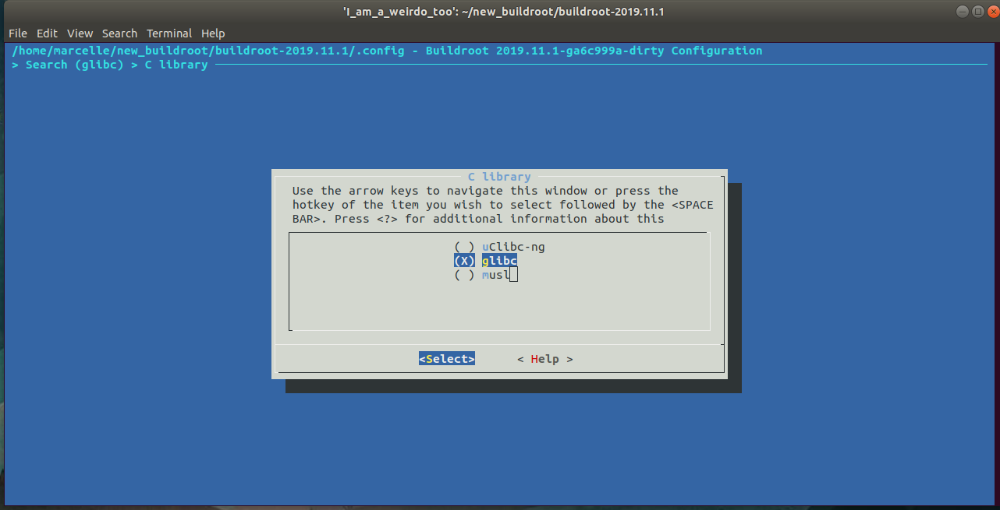

- change image size

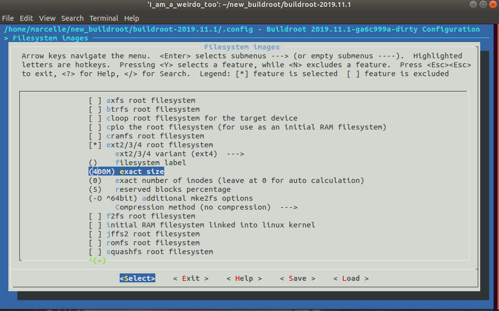

- add root password here, and also select "Enable root login with password"    

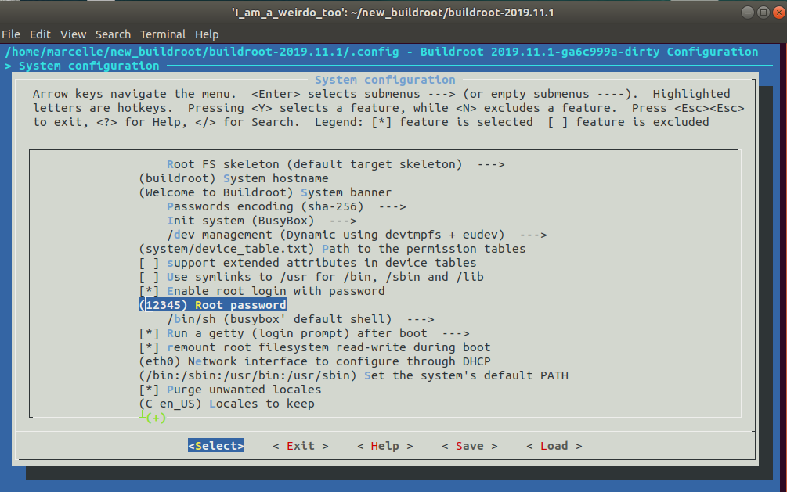

- change dev manager

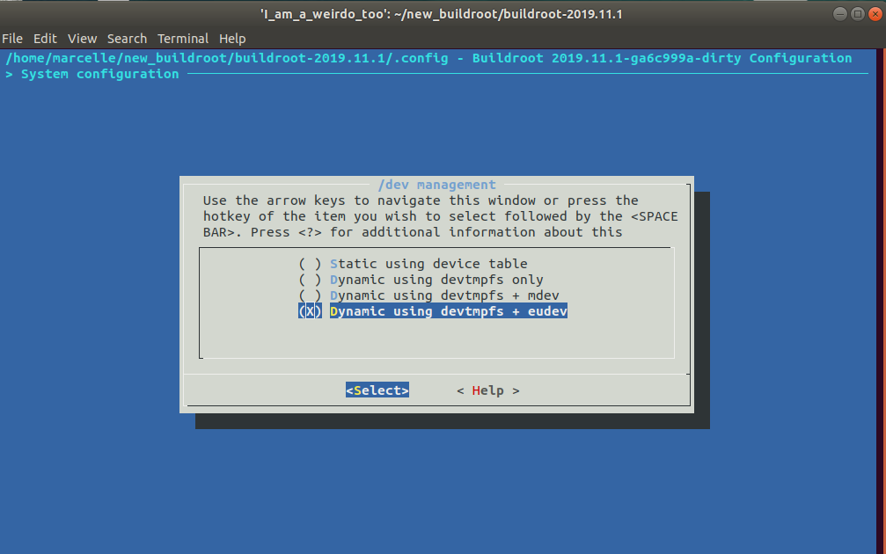

- add your postbuild scripts here after putting them in board/raspberrypi3 directory in build root files,\
seperate between them using space.

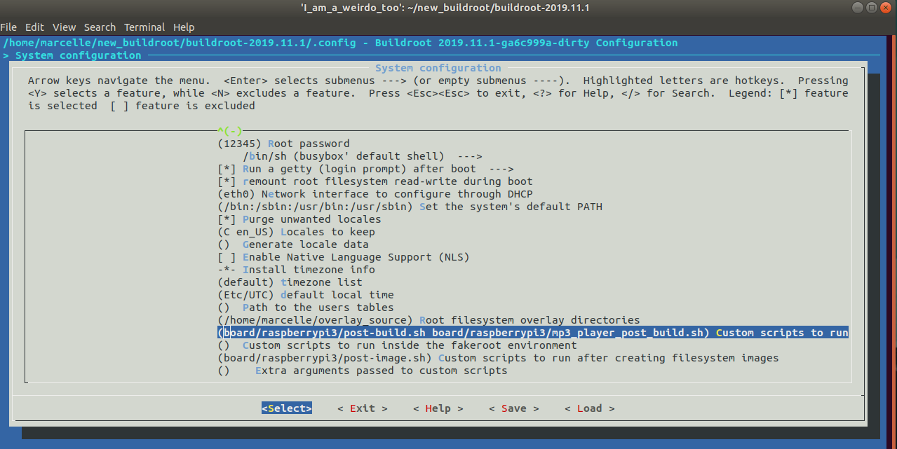

- add your overlay source directory here

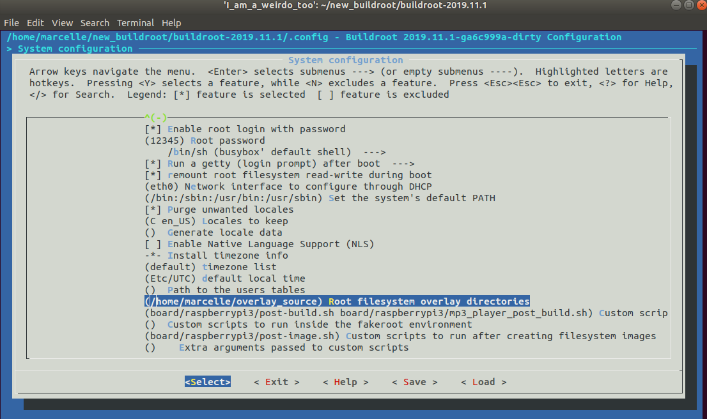

- We need to add support for ssh in our image

## Target packages  --->  Audio and video applications

- select alsa utils and all packages in it

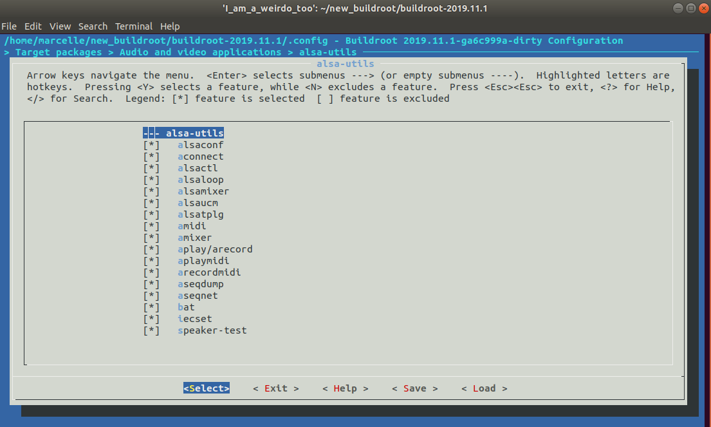

- also select atest, aumix, espeak, ffmpeg, jack1

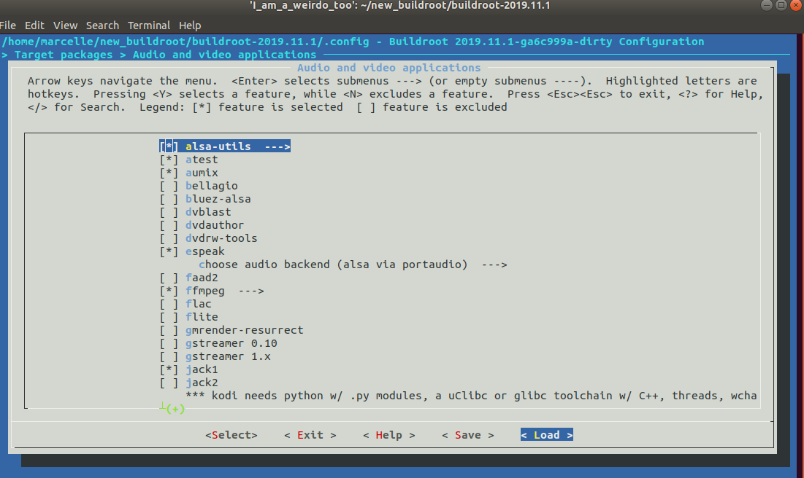

- also select pulseaudio, sox

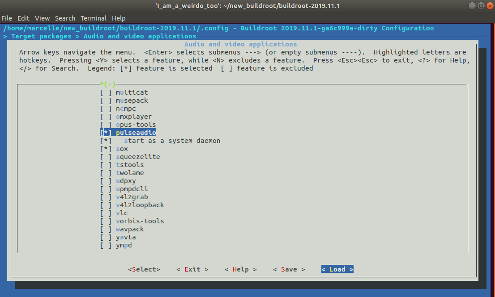

## Target packages  --->  Libraries  --->  Audio/Sound

- select alsa-lib and all packages in it, also select bcg729

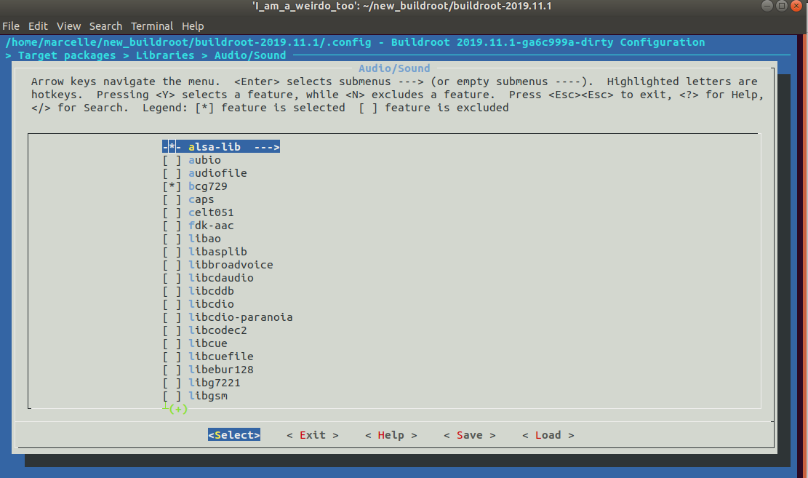

- also select libmad, and Architecture-specific optimizations, also libid3tag

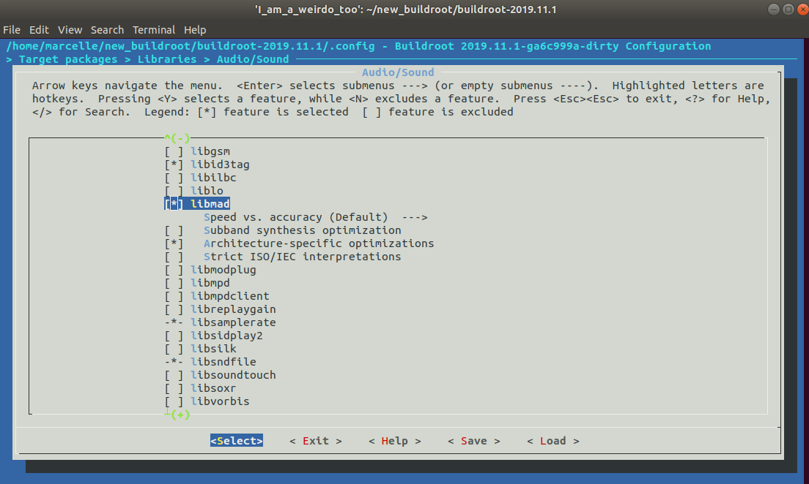

- also select sbc, portaudio alsa support and c++ binding

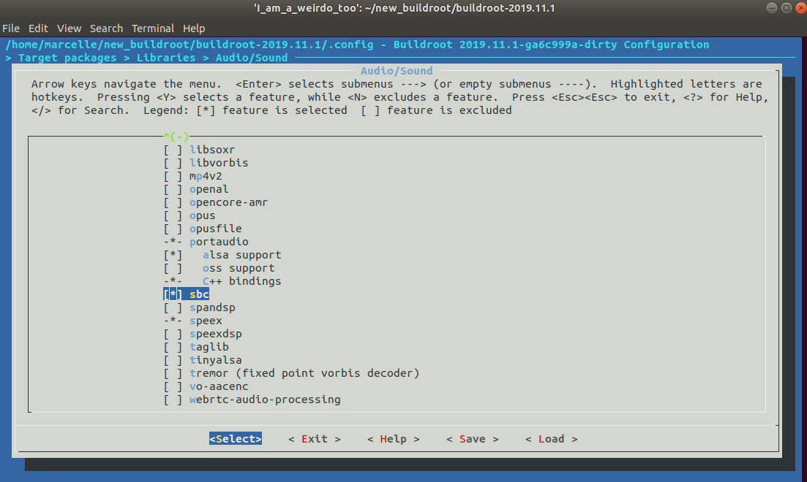

##  Target packages  --->  Hardware handling

- from Firmware, select b43-firmware, rpi-firmware, and rpi-wifi-firmware

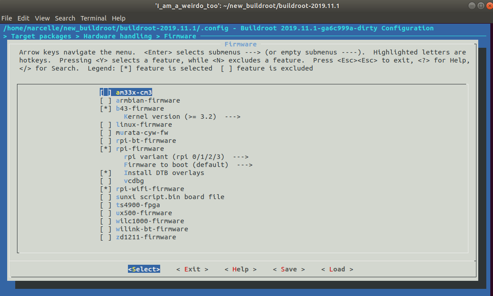

- and select dbus, dbus-glib, and eudev -> enable hwdb installation

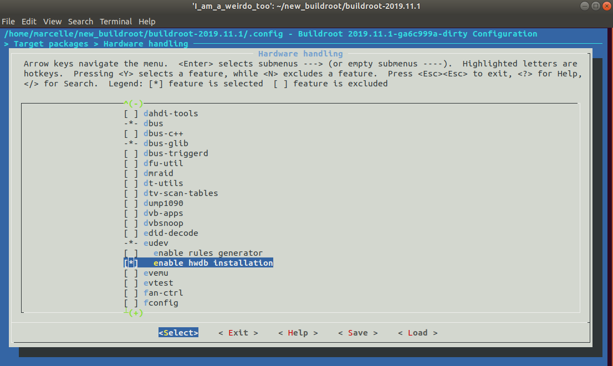

- also select rpi-userland and the 2 options in it

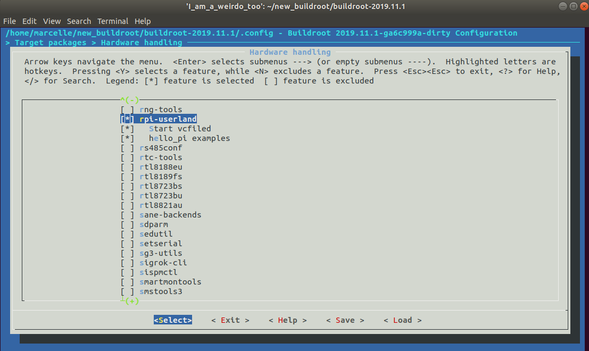

You can start the build simply by typing make command, or to collect some information about our build in order to use them later for debugging if the build failed use:
>time make 2>&1 | tee build.log

