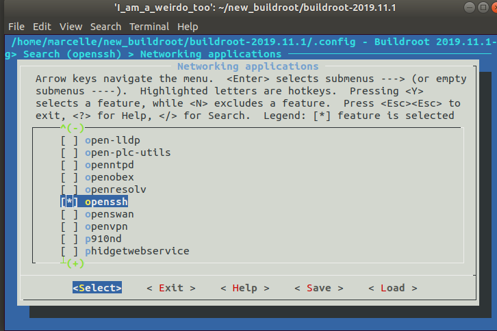

# mp3 player (music box) 

using RaspberryPi 3 B+, customized Buildroot image, 
and 4 mechanical push buttons
>pause/play button\
>shuffle button\
>previous button\
>next button

the voice can be over:

>bluetooth speakers\
>HDMI\
>wired speakers

Note: bluetooth speaker is highest priority and wired speaker is the lowest you can chane the priority by editing output_selector.sh script.

you can access RaspberryPi terminal through 
>Ethernet\
>WIFI\
>HDMI\
>UART

## Buildroot source
- you can download a clean repo from:
http://git.buildroot.net/buildroot/ 

## Navigate and do basic configuration

Apply the default configuration for our raspberry pi:
>make raspberrypi3_defconfig

To view and edit the configuration one by one we will use the menuconfig:
>make menuconfig

- We need to add support for ssh in our image

